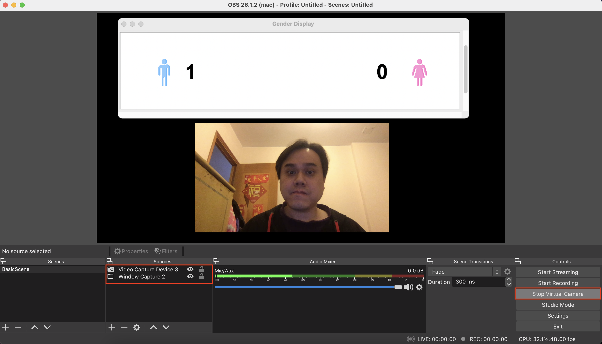

# face_gender
Simple face gender detection for an online meeting, modified based on [face-emotion](https://github.com/DeepSE/face-emotion)


## How to run the program?

- Using `venv` to avoid polluting the Python environment
    - [Python virtual environment tutorial](https://docs.python.org/3/tutorial/venv.html)

```bash
python3 -m venv --system-site-packages ./venv
source venv/bin/activate
pip install -r requirements.txt
python main.py
```

## How to use the program in a Zoom meeting?

Step 1 - Install `OBS` and set up a virtual camera

- `OBS` stands for [Open Broadcaster Software](https://obsproject.com/)
    - Free and open source for broadcasters
- Add a video capture device
- Add a Window capture and select the program window
- `Start Virtual Camera` (bottom-right corner)
    - Once the virtual camera is started, the button text becomes `Stop Virtual Camera`




Step 2 - Open Zoom and select the virtual camera 

- Remember, you should select the `OBS Virtual Camera` (instead of your default webcam)


Step 3 - Select Gallery View in Zoom

- The application will keep detecting faces 
    - By default, the face detection is executed per second 
    - The update frequency `WAIT_SECONDS` can be adjusted in `main.py`
        - A lower value can be set for an older laptop


### Demo Screenshots

Example 1 - Only 1 man on the screen


Example 2 - 1 man and 1 woman on the screen 


Example 3 - Multiple people on the screen

- Note: The sample Zoom screenshot is downloaded from the web


## Setting up the Python environment using pyenv

- Setup `pyenv` if you have multiple Python installed version
    - For some reason, installing Python via `pyenv` does not support `Tcl/Tk` by default
    - This application needs `Tcl/Tk` support, you need to follow this [stackoverflow discussion](https://stackoverflow.com/questions/60469202/unable-to-install-tkinter-with-pyenv-pythons-on-macos) in order to install a Python environment with `Tcl/Tk` support


# IdentityGenderNet
